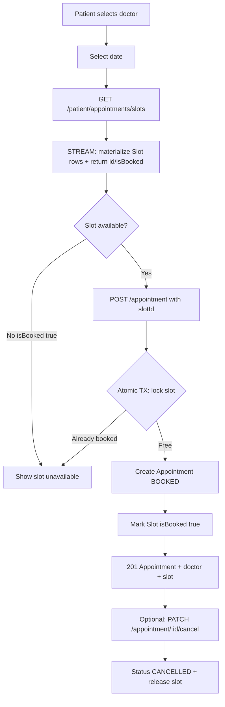

# Day 6 — Appointment Booking Flow

Deploy note: slots are **persisted** (`slots` table) when a patient/doctor fetches STREAM slots. Booking/cancel update the same rows, so Railway/Render restarts keep availability consistent as long as Postgres data is retained.

## Endpoints

| Method | Path | Role |
|--------|------|------|
| POST | `/appointment` | PATIENT |
| GET | `/appointment/my` | PATIENT |
| PATCH | `/appointment/:id/cancel` | PATIENT |
| GET | `/doctor/appointments` | DOCTOR |
| GET | `/patient/appointments/slots` | public (Day 5 — returns `id` for STREAM) |
