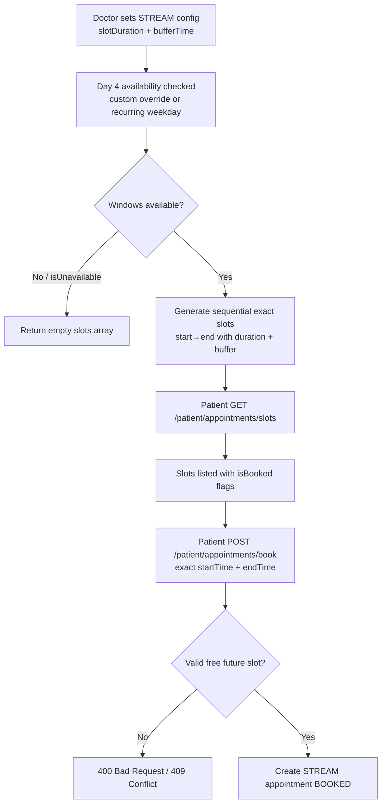
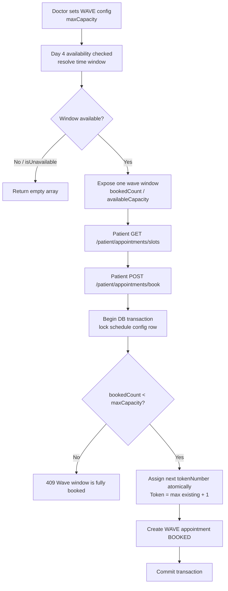
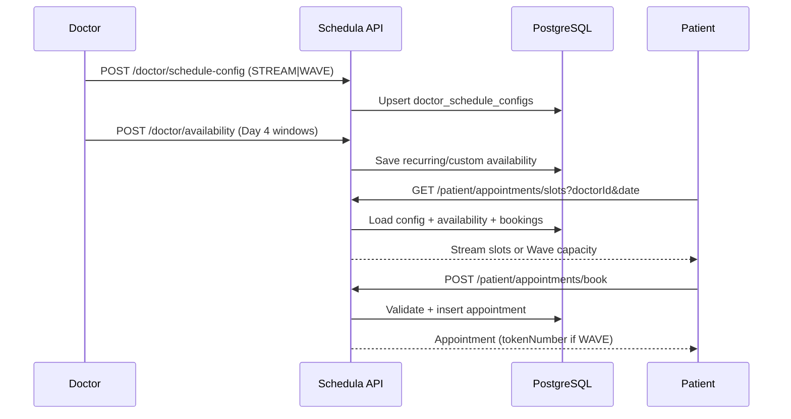

# Day 5 — Advanced Scheduling Flows

Related code: `src/scheduling/` (config, slots, booking) · `src/appointments/entities/appointment.entity.ts` · migration `1753300000000-AddAdvancedSchedulingAndAppointments.ts`.

## Stream scheduling

## Wave scheduling

## End-to-end sequence

